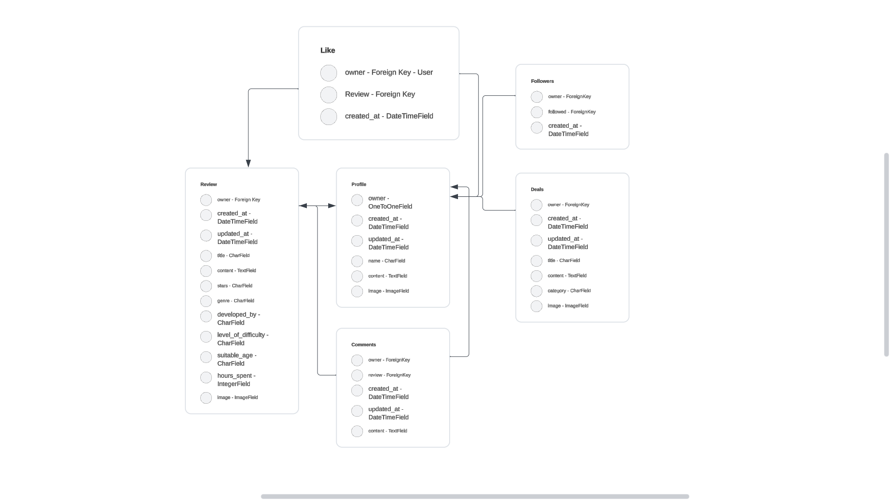

# Arcade Slate API

Arcade Slate is an online application that allows users to post reviews and deals, like and comment under reviews and follow other users.

The project has been split into two parts - the frontend built with React, and the backend powered by the Django REST Framework.

Link to the live site - [Arcade Slate](https://arcade-slate-api-aec03c6d03e8.herokuapp.com)

# User Stories

I decided not to write user stories for backend as all of them are covered in frontend's user stories.

Link to frontend's user stories in readme -

Link to project's issues - [Arcade Slate's issues](https://github.com/pozhara/arcade-slate/issues)

Link to project board - [Arcade Slate project board](https://github.com/users/pozhara/projects/13)

# Database Schemas



The Arcade Slate database was created using six models. There are two different post types - reviews and deals. Users can also interact with reviews and other users using likes,comments and follow. The profile model allows for further profile customisation.

# Testing

## Validator Tests

All Python code has been run through the [CI PEP8 Linter](https://pep8ci.herokuapp.com/). Blank lines and line too long errors were corrected. No known errors left.

## Manual Tests

No manual tests were done due to an issue I encountered while trying to run them. The terminal would give this message every time I tried to run tests:

> Creating test database for alias 'default'...
/workspace/.pip-modules/lib/python3.9/site-packages/django/db/backends/postgresql/base.py:304: RuntimeWarning: Normally Django will use a connection to the 'postgres' database to avoid running initialization queries against the production database when it's not needed (for example, when running tests). Django was unable to create a connection to the 'postgres' database and will use the first PostgreSQL database instead.
warnings.warn
Got an error creating the test database: permission denied to create database

I tried searching for possible solutions but unfortunately didn't find them.

| Status | Deals and reviews
|:-------:|:--------|
| &check; | Correct list URL path
| &check; | Correct deal and review URL path
| &check; | Add deal and review functionality
| &check; | Edit deal and review functionality
| &check; | Delete deal and review functionality
| &check; | Correct deal and review fields
| &check; | Non authenticated users can't post deals and reviews
| &check; | Only authenticated owners can update or delete their own deals and reviews
| &check; | Search functionality
| &check; | Ordering functionality
| &check; | Default image URLs correct
| &check; | Count fields functionality working correctly

| Status | Profiles
|:-------:|:--------|
| &check; | User profile automatically created on sign up
| &check; | Correct list URL path
| &check; | Correct profile URL path
| &check; | Edit profile functionality
| &check; | Correct profile fields
| &check; | Only authenticated owners can update their own profile
| &check; | Ordering functionality
| &check; | Default image URLs correct
| &check; | Count fields functionality working correctly

| Status | Comments
|:-------:|:--------|
| &check; | Correct list URL path
| &check; | Correct comment URL path
| &check; | Add comment functionality
| &check; | Edit comment functionality
| &check; | Delete comment functionality
| &check; | Correct comment fields
| &check; | Non authenticated users can't create comments
| &check; | Only authenticated owners can update their own comment
| &check; | Correct review or deal id

| Status | Followers
|:-------:|:--------|
| &check; | Correct list URL path
| &check; | Correct follower URL path
| &check; | Follow functionality
| &check; | Unfollow functionality
| &check; | Non authenticated users can't follow other users
| &check; | Only authenticated owners can unfollow a user

| Status | Likes
|:-------:|:--------|
| &check; | Correct list URL path
| &check; | Correct like URL path
| &check; | Like functionality
| &check; | Unlike functionality
| &check; | Non authenticated users can't like reviews and deals
| &check; | Only authenticated owners can unlike reviews and deals
| &check; | Pagination functioning
| &check; | Correct review or deal id 
| &check; | Correct owner 

## Bugs

All bugs I encountered were due to misspelling words and not using correct punctuation marks, they were quickly resolved.

# Technologies Used

## Languages

- [Python](https://www.python.org/) - Python is a programming language.

## Frameworks

- [Django](https://www.djangoproject.com/) - Django is a Python-based web framework.
- [Django REST Framework](https://www.django-rest-framework.org/) - Django REST framework is a toolkit used for building Web APIs using Python.

## Software 

- [Slack](https://slack.com/intl/en-gb/) - Slack is a messanger.
- [GitHub](https://github.com/) - GitHub is an Internet hosting service.
- [GitPod](https://www.gitpod.io/) - Gitpod is a cloud development environment.
- [Heroku](https://dashboard.heroku.com/) - Heroku is a hosting apps service
- [Elephant SQL](https://www.elephantsql.com/) - PostgreSQL databases

## Libraries

- [asgiref](https://pypi.org/project/asgiref/) - ASGI specs, helper code, and adapters
- [cloudinary](https://pypi.org/project/cloudinary/) - Python and Django SDK for Cloudinary
- [dj-database-url](https://pypi.org/project/dj-database-url/) - Allows database URL environment variables within Django
- [dj-rest-auth](https://pypi.org/project/dj-rest-auth/) - Authentication and Registration in Django Rest Framework
- [Django](https://pypi.org/project/Django/) - Python web framework
- [django-allauth](https://pypi.org/project/django-allauth/) - Integrated set of Django applications addressing authentication, registration, account management as well as 3rd party (social) account authentication
- [django-cloudinary-storage](https://pypi.org/project/django-cloudinary-storage/) - Django package that provides Cloudinary storages for both media and static files
- [django-cors-headers](https://pypi.org/project/django-cors-headers/) - Django application for handling the server headers required for Cross-Origin Resource Sharing (CORS)
- [django-filter](https://pypi.org/project/django-filter/) - Django application for allowing users to filter querysets dynamically
- [djangorestframework](https://pypi.org/project/djangorestframework/) - toolkit for building Web APIs
- [djangorestframework-simplejwt](https://pypi.org/project/djangorestframework-simplejwt/) -  A minimal JSON Web Token authentication plugin for Django REST Framework
- [gunicorn](https://pypi.org/project/gunicorn/) - WSGI HTTP Server for UNIX
- [oauthlib](https://pypi.org/project/oauthlib/) -  A generic, spec-compliant, thorough implementation of the OAuth request-signing logic
- [Pillow](https://pypi.org/project/Pillow/) - Python Imaging Library (Fork)
- [psycopg2](https://pypi.org/project/psycopg2/) - Python-PostgreSQL Database Adapter
- [PyJWT](https://pypi.org/project/PyJWT/) - JSON Web Token implementation in Python
- [python3-openid](https://pypi.org/project/python-openid3/) - OpenID support for servers and consumers
- [pytz](https://pypi.org/project/pytz/) - World timezone definitions
- [requests-oauthlib](https://pypi.org/project/requests-oauthlib/) - OAuthlib authentication support for Requests
- [sqlparse](https://pypi.org/project/sqlparse/) - A non-validating SQL parser
- [urllib3](https://pypi.org/project/urllib3/) - HTTP client for Python

# Deployment

Steps:
1. Create Heroku app
2. Create external database
3. Connect external database to Heroku
4. Install and configure libraries
5. Set environment variables
6. Connect the project's Github repo to Heroku

### Create Heroku App

1. On the Heroku dashboard create a new app
2. Add a name for the app
3. Select a region closest to your location

### Create external database

4. Log into Elephant SQL or sign up
5. Click the "Create new instance" button
6. Give the database a name
7. Select the tiny turtle plan
8. Select a data centre region closest to your location
9. Click review and then create instance
10. Return to the dashboard and click on the database instance name
11. Copy the ElephantSQL database URL

### Connect the external database to Heroku

12. Open the app in Heroku
13. Open the settings tab
14. Click to reveal config vars
15. Add a config var called DATABASE_URL with the ElephantSQL database URL as the value

### Install and configure libraries

16. Open the project in a code editor
17. In the terminal, use the command `pip install dj_database_url`
18. In the app settings file add an import to the top of the file `import dj_database_url`
19. Separate the development and production databases by replacing the DATABASES variable with the following code:
```
if 'DEV' in os.environ:
    DATABASES = {
        'default': {
            'ENGINE': 'django.db.backends.sqlite3',
            'NAME': BASE_DIR / 'db.sqlite3',
        }
    }
else:
    DATABASES = {
        'default': dj_database_url.parse(os.environ.get("DATABASE_URL"))
    }
```
20. In the terminal, use the command `pip install gunicorn`
21. Create a new file in the root directory called Procfile
22. Add the following code:
```
release: python manage.py makemigrations && python manage.py migrate
web: gunicorn drf_api.wsgi
```
23. In the app settings.py file, set allowed hosts:
```
ALLOWED_HOSTS = ['localhost', os.environ.get('ALLOWED_HOST')]
```
24. In the terminal, use the command `pip install django-cors-headers`
25. Add 'corsheaders' to the list of installed apps in the app settings.py file
26. Add 'corsheaders.middleware.CorsMiddleware' to the top of the settings.py middleware list
27. Add the following code to the app settings.py file beneath the middleware list:
```
if 'CLIENT_ORIGIN_DEV' in os.environ:
    extracted_url = re.match(r'^.+-', os.environ.get('CLIENT_ORIGIN_DEV', ''), re.IGNORECASE).group(0)
    CORS_ALLOWED_ORIGIN_REGEXES = [
        rf"{extracted_url}(eu|us)\d+\w\.gitpod\.io$",
    ]
```
28. Add the following code `CORS_ALLOW_CREDENTIALS = True`
29. Add the cors allowed origins list and add the frontend URL
```
CORS_ALLOWED_ORIGINS = [
    '<FRONT END APP URL>',
]
```
30. Add the following code
```
JWT_AUTH_SAMESITE = 'None'
```

### Set environment variables

31. In the env.py file add the following code with a secret key `os.environ['SECRET_KEY'] = 'yoursecretkey'`
32. In the settings.py file replace the insecure secret key variable with `SECRET_KEY = os.environ.get('SECRET_KEY')`
33. Replace the DEBUG variable with `DEBUG = 'DEV' in os.environ`
34. In Heroku add new config vars with the cloudinary URL and secret key variables and values
35. Add a disable collect static config var `DISABLE_COLLECTSTATIC = 1`
36. Add the following config vars to allow API access from dev and production URLs:
```
ALLOWED_HOST = <API URL.herokuapp.com>
CLIENT_ORIGIN = <FRONT END URL.herokuapp.com>
CLIENT_ORIGIN_DEV = <IDE DEV URL>
```
37. In the project update the requirements.txt file by running the following terminal command `pip freeze > requirements.txt`
38. Git add, commit and push the code changes to the repository

### Connect the projects GitHub repo to Heroku

39. In the Heroku app dashboard click the deploy tab and select GitHub as the deployment method
40. Search for the GitHub repository name and click connect
41. In the manual deploy section choose the main branch
42. Click 'deploy branch'
43. Open the app to view when build is completed.

# Credits

## Code

Code Institute's drf_api walkthrough was used as a base and I relied on it to complete the backend part of this project.
