# Arcade Slate API

Arcade Slate is an online application that allows users to post reviews and deals, like and comment under reviews and follow other users.

The project has been split into two parts - the frontend built with React, and the backend powered by the Django REST Framework.

Link to the live site - [Arcade Slate](https://arcade-slate-api-aec03c6d03e8.herokuapp.com)

# Project

## Objective

To provide a platform for posting reviews and sharing deals for gamers.

## Site User Goal

Users may post reviews for games they've played, share deals from different shops, like posts and follow each other.

## Site Owner Goal

To provide enjoyable user experience, keep navigation intuitive.

## Target Audience

Target audience is gamers. They look for more games to play and want to read the reviews of other games who have played them.

## Project Management

### GitHub Project Board

All user stories were added to the to-do section. When working on them, they were moved to in progress section, and on their completion, to done section.

You can view the project board [here](https://github.com/users/pozhara/projects/13/views/1).

### Database Schema

The Arcade Slate database was created using six models. There are two different post types - reviews and deals. Users can also interact with reviews and other users using likes,comments and follow. The profile model allows for further profile customisation.

# User Stories

## Epic 1 - User Authentication

**Sign up**: As a user I can create a new account so that I can access all the features for signed up users

**Sign in**: As a user I can sign in to the app so that I can access functionality for logged in users

**Logged in status**: As a user I can tell if I'm logged in or not so that I can log in if I need to

**Refreshing access token**: As a user I can maintain my logged in status until I choose to log out or session runs out so that my user experience is not compromised

## Epic 2 - Navigation

**Navigation**: As a user I can see the navbar on every page so that I can navigate easily between pages

**Conditional rendering**: As a logged out user I can see sign in and sign up options so that I can sign in/sign up

## Epic 3 - Reviews

**Create posts**: As a logged in user I can create posts so that I can share my thoughts about a game

**View a post**: As a user I can view a single post so that I can learn more about it and see the comments

**View most recent posts**: As a user I can view all the most recent posts, ordered by most recently created first so that I am up to date with the newest content

**Filtering**: As a user I can search for posts with keywords so that I can find the posts and user profiles I am most interested in

**View liked reviews**: As a user I can view reviews I liked so that I can find the reviews I enjoyed or want to save

**Infinite scroll**: As a user I can keep scrolling through posts so that I don't have to click 'next page' button etc

**Edit and delete a post**: As a post owner I can edit or delete a post so that I can make corrections to it or update the information

## Epic 4 - Deals

**Create posts**: As a logged in user I can create posts so that I can share my thoughts about a game

**View a post**: As a user I can view a single post so that I can learn more about it and see the comments

**View most recent posts**: As a user I can view all the most recent posts, ordered by most recently created first so that I am up to date with the newest content

**Filtering**: As a user I can search for posts with keywords so that I can find the posts and user profiles I am most interested in

**Infinite scroll**: As a user I can keep scrolling through posts so that I don't have to click 'next page' button etc

**Edit and delete a post**: As a post owner I can edit or delete a post so that I can make corrections to it or update the information

## Epic 5 - Comments

**Create a comment**: As a logged in user I can comment under reviews so that I can share my thoughts on it

**Comment date**: As a user I can see how long ago a comment was posted so that I know how old a comment is

**View comments**: As a user I can read comments on reviews so that I can read what other users think about it

**Delete comments**: As an owner of a comment I can delete it so that I am able to control what I posted

**Edit comment**: As an owner of a comment I can edit it so that I can update it's content in case I made a typo or changed my thoughts

## Epic 6 - Likes

**Like/Unlike a review**: As a logged in user I can like a review so that the owner knows I liked their thoughts and I can unlike it in case I changed my mind

## Epic 7 - Profiles

**Most followed profiles**: As a user I can see a list of the most followed profiles so that I can see which profiles are popular

**User stats**: As a user I can view statistics of a specific user so that I can learn more about their activity

**Profile page**: As a user I can view other users' profiles so that I can see their reviews and learn more about them

**View all reviews by a specific user**: As a user I can view all the reviews so that I can catch up on their latest reviews, or decide if I want to follow them

**Follow/Unfollow a user**: As a logged in user I can follow and unfollow other users so that I can view or remove their reviews from my feed page

**Edit profile**: As a logged in user I can edit my profile so that I can change my profile picture and bio

**Update username and password**: As a logged in user I can update my username and change my password so that I can change my displayed name and keep my profile secure

## User stories that were not implemented

**Like deals**: As a user I can like a deal so that I can show my reaction to the post

**Comment under deals**: As a user I can comment under a deal to share my thoughts about the post

Unfortunately, I didn't have enought time to implement these two user stories and features in frontend so they were left for future iterations.

# Features

## Existing features

### Sign-up page

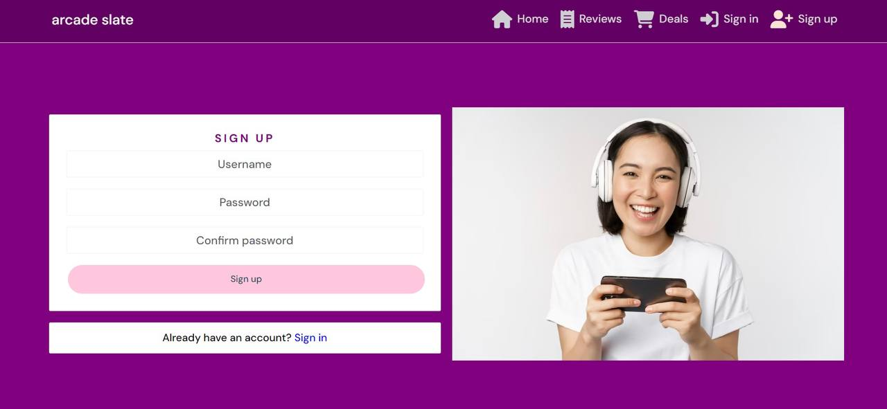

### Sign-in page

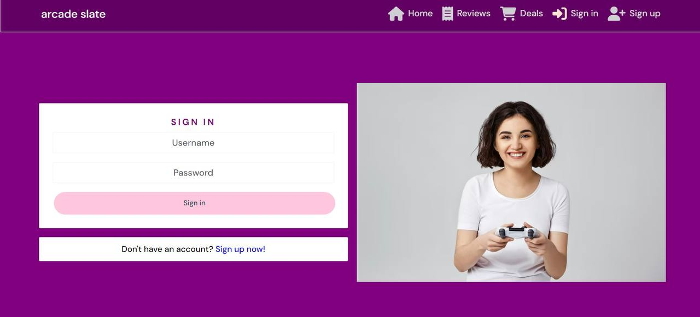

### Sign-out

After signing out user is redirected to home page.

### Home page

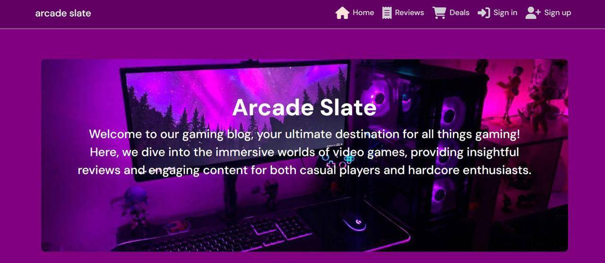

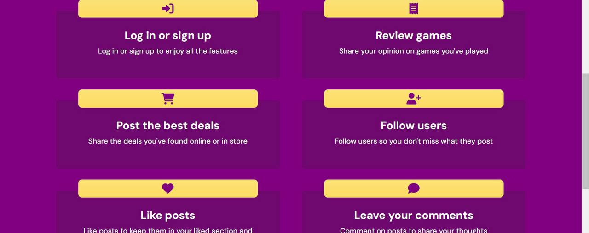

### Reviews page

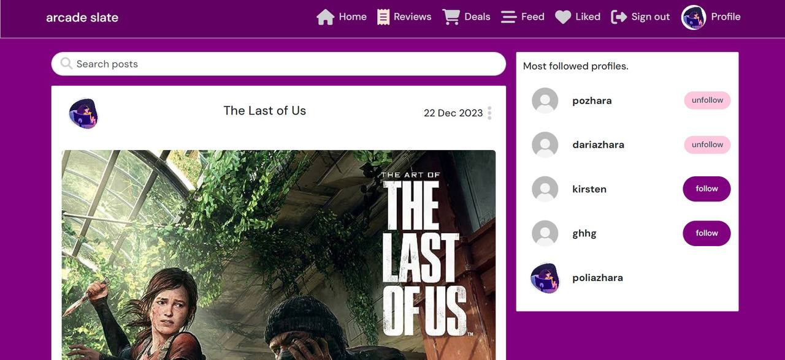

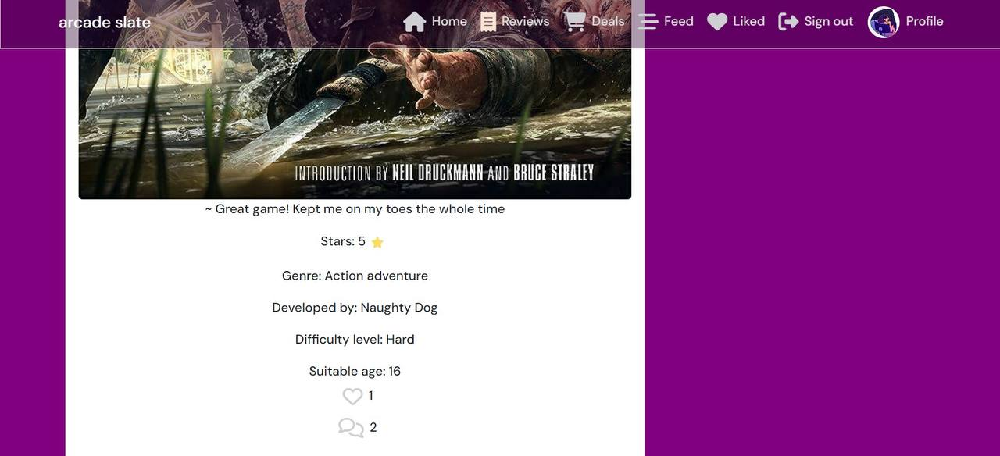

### Liked page

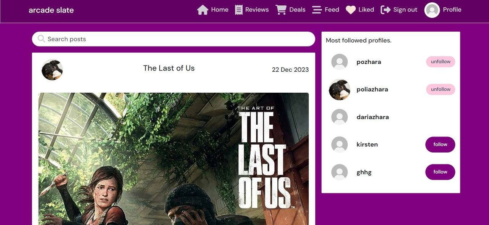

### Feed

### Review page

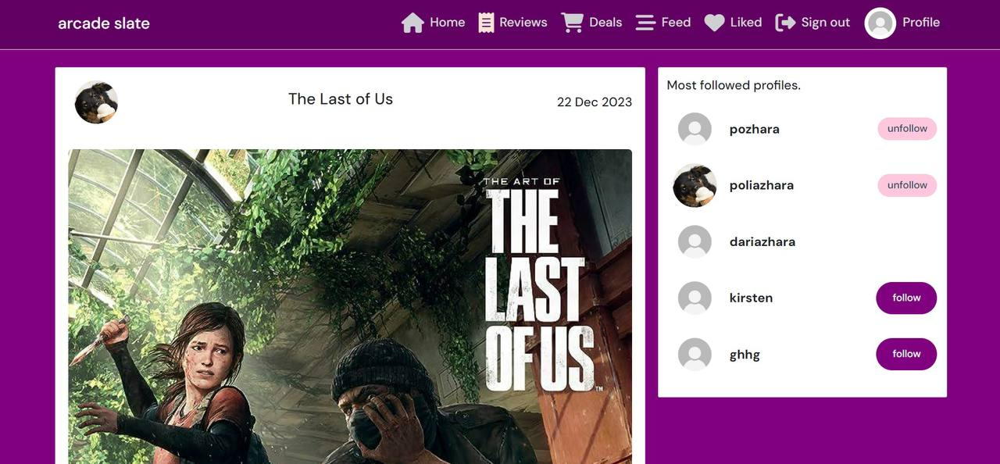

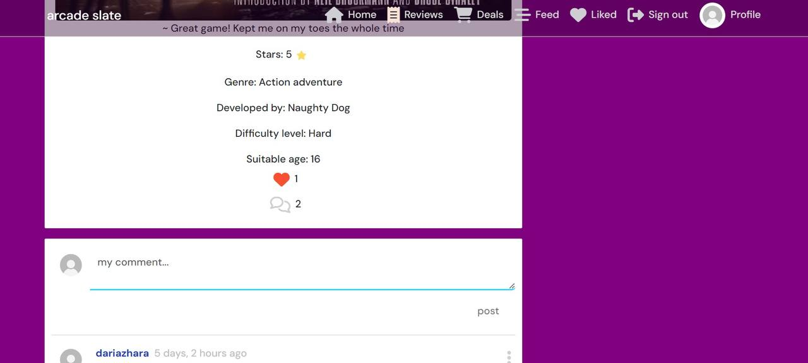

### Deals page

### Deal page

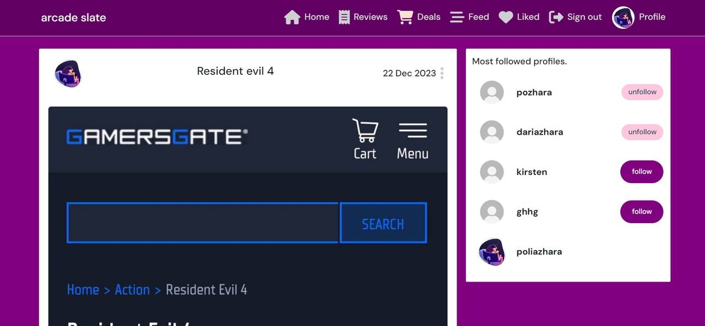

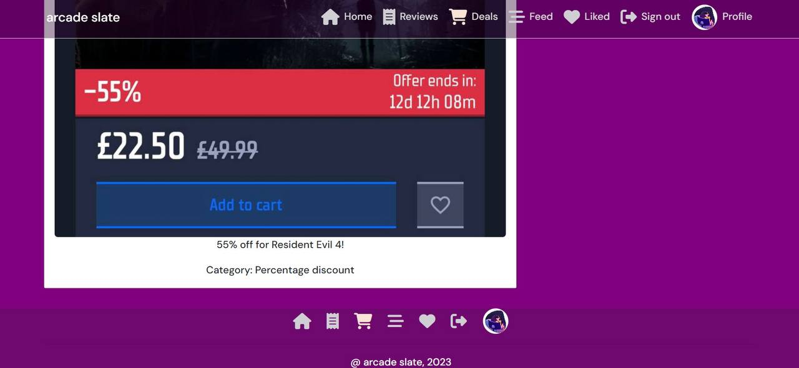

### Create/Edit review

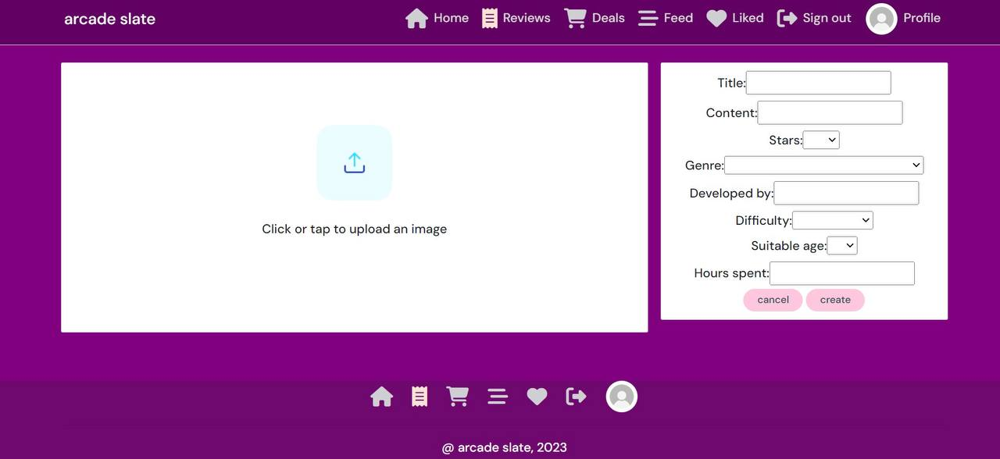

### Create/Edit deal

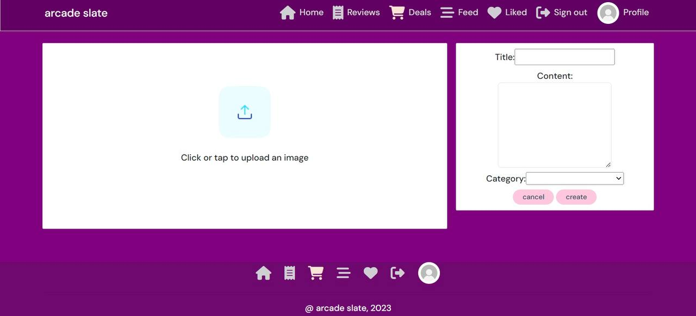

### Profile page

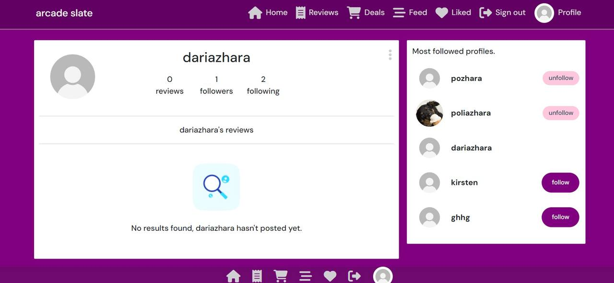

### Edit profile

### Change password

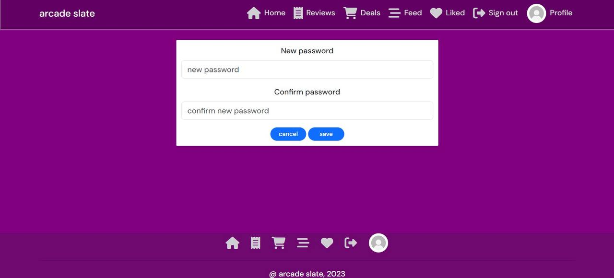

## Future features

1. As I didn't have enought time to implement liking and commenting functionality for deals in frontend, it had to be left for future.

2. Success messages for signing in/up/out, creating/editing/deleting posts.

## Components

### Avatar

### Comment

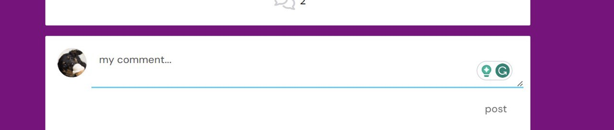

### Footer

### HomeAbout

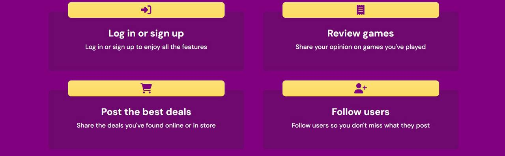

### HomeHero

### MoreDropdown

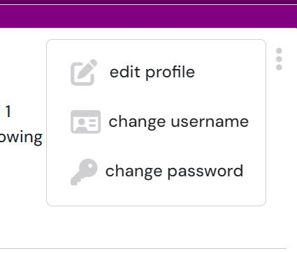

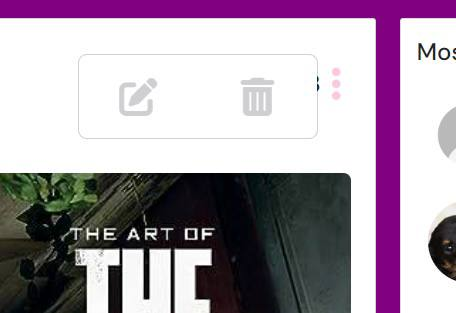

### NavBar

# Testing

## Validator tests

### W3C HTML

#### Sign-up page

#### Sign-in page

#### Home page

#### Reviews page

#### Liked page

#### Feed

#### Review page

#### Deals page

#### Deal page

#### Create/Edit review

#### Create/Edit deal

#### Profile page

#### Edit profile

#### Change password

### W3C CSS

### ESLint JavaScript