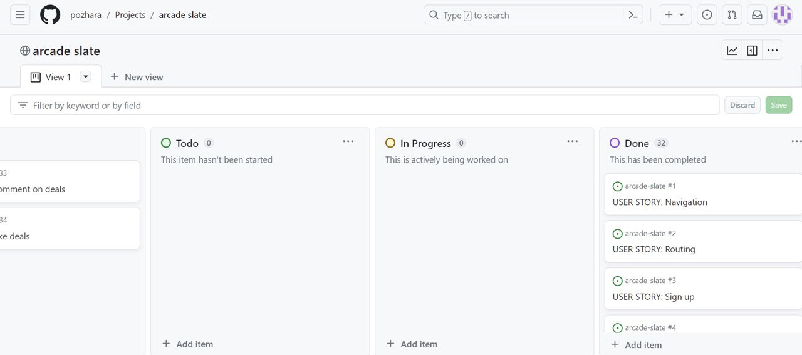
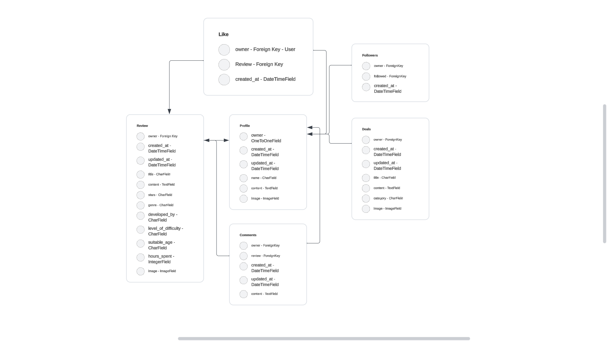

# Arcade Slate API

Arcade Slate is an online application that allows users to post reviews and deals, like and comment under reviews and follow other users.

The project has been split into two parts - the frontend built with React, and the backend powered by the Django REST Framework.

Link to the live site -

Link to the live API -

# Project

## Objective

To provide a platform for posting reviews and sharing deals for gamers.

## Site User Goal

Users may post reviews for games they've played, share deals from different shops, like posts and follow each other.

## Site Owner Goal

To provide enjoyable user experience, keep navigation intuitive.

## Target Audience

Target audience is gamers. They look for more games to play and want to read the reviews of other games who have played them.

## Project Management

### GitHub Project Board

All user stories were added to the to-do section. When working on them, they were moved to in progress section, and on their completion, to done section.

You can view the project board !!!!here.

### Database Schema

The Arcade Slate database was created using six models. There are two different post types - reviews and deals. Users can also interact with reviews and other users using likes,comments and follow. The profile model allows for further profile customisation.

# User Experience UX

There were no wireframes for this project as the layout and styles were taken from Code Institute's Moments walkthrough.

# User Stories

## Epic 1 - User Authentication

**Sign up**: As a user I can create a new account so that I can access all the features for signed up users

**Sign in**: As a user I can sign in to the app so that I can access functionality for logged in users

**Logged in status**: As a user I can tell if I'm logged in or not so that I can log in if I need to

**Refreshing access token**: As a user I can maintain my logged in status until I choose to log out or session runs out so that my user experience is not compromised

## Epic 2 - Navigation

**Navigation**: As a user I can see the navbar on every page so that I can navigate easily between pages

**Conditional rendering**: As a logged out user I can see sign in and sign up options so that I can sign in/sign up

## Epic 3 - Reviews

**Create posts**: As a logged in user I can create posts so that I can share my thoughts about a game

**View a post**: As a user I can view a single post so that I can learn more about it and see the comments

**View most recent posts**: As a user I can view all the most recent posts, ordered by most recently created first so that I am up to date with the newest content

**Filtering**: As a user I can search for posts with keywords so that I can find the posts and user profiles I am most interested in

**View liked reviews**: As a user I can view reviews I liked so that I can find the reviews I enjoyed or want to save

**Infinite scroll**: As a user I can keep scrolling through posts so that I don't have to click 'next page' button etc

**Edit and delete a post**: As a post owner I can edit or delete a post so that I can make corrections to it or update the information

## Epic 4 - Deals

**Create posts**: As a logged in user I can create posts so that I can share my thoughts about a game

**View a post**: As a user I can view a single post so that I can learn more about it and see the comments

**View most recent posts**: As a user I can view all the most recent posts, ordered by most recently created first so that I am up to date with the newest content

**Filtering**: As a user I can search for posts with keywords so that I can find the posts and user profiles I am most interested in

**Infinite scroll**: As a user I can keep scrolling through posts so that I don't have to click 'next page' button etc

**Edit and delete a post**: As a post owner I can edit or delete a post so that I can make corrections to it or update the information

## Epic 5 - Comments

## Epic 6 - Likes

## Epic 7 - Profiles