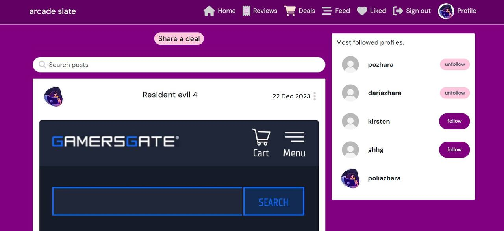
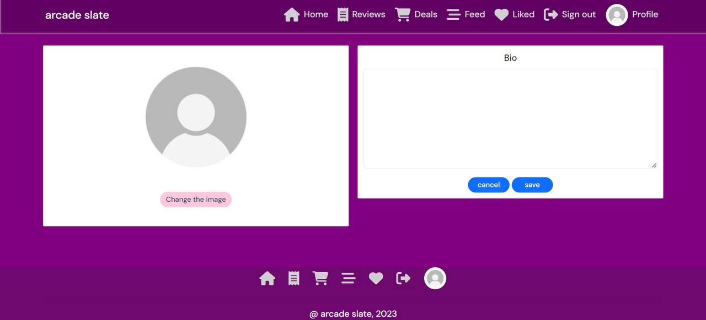
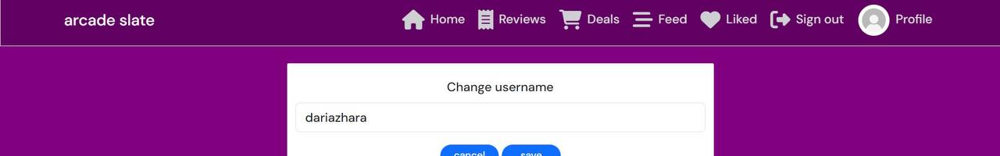
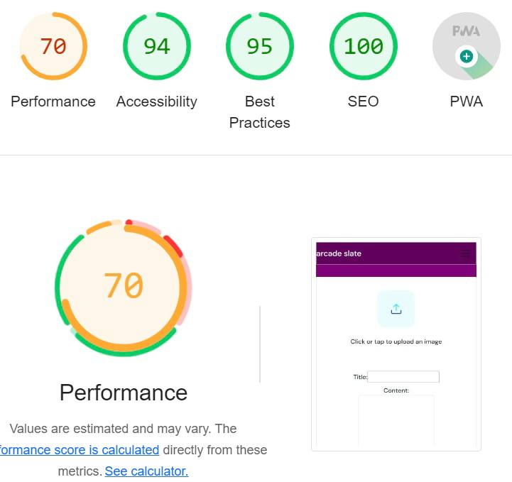
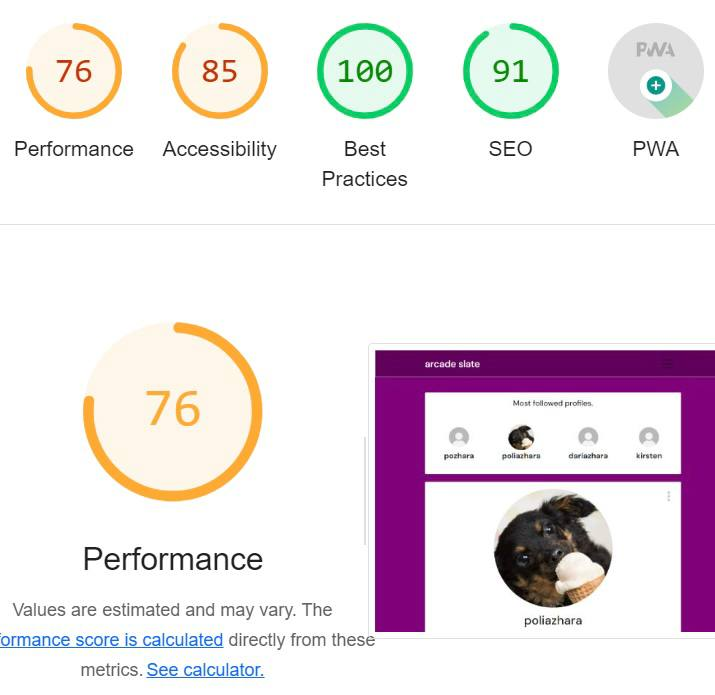

# Arcade Slate API

Arcade Slate is an online application that allows users to post reviews and deals, like and comment under reviews and follow other users.

The project has been split into two parts - the frontend built with React, and the backend powered by the Django REST Framework.

Link to the live site - [Arcade Slate](https://arcade-slate-api-aec03c6d03e8.herokuapp.com)

# Project

## Objective

To provide a platform for posting reviews and sharing deals for gamers.

## Site User Goal

Users may post reviews for games they've played, share deals from different shops, like posts and follow each other.

## Site Owner Goal

To provide enjoyable user experience, keep navigation intuitive.

## Target Audience

Target audience is gamers. They look for more games to play and want to read the reviews of other games who have played them.

## Project Management

### GitHub Project Board

All user stories were added to the to-do section. When working on them, they were moved to in progress section, and on their completion, to done section.

You can view the project board [here](https://github.com/users/pozhara/projects/13/views/1).

### Database Schema

The Arcade Slate database was created using six models. There are two different post types - reviews and deals. Users can also interact with reviews and other users using likes,comments and follow. The profile model allows for further profile customisation.

# User Stories

## Epic 1 - User Authentication

**Sign up**: As a user I can create a new account so that I can access all the features for signed up users

**Sign in**: As a user I can sign in to the app so that I can access functionality for logged in users

**Logged in status**: As a user I can tell if I'm logged in or not so that I can log in if I need to

**Refreshing access token**: As a user I can maintain my logged in status until I choose to log out or session runs out so that my user experience is not compromised

## Epic 2 - Navigation

**Navigation**: As a user I can see the navbar on every page so that I can navigate easily between pages

**Conditional rendering**: As a logged out user I can see sign in and sign up options so that I can sign in/sign up

## Epic 3 - Reviews

**Create posts**: As a logged in user I can create posts so that I can share my thoughts about a game

**View a post**: As a user I can view a single post so that I can learn more about it and see the comments

**View most recent posts**: As a user I can view all the most recent posts, ordered by most recently created first so that I am up to date with the newest content

**Filtering**: As a user I can search for posts with keywords so that I can find the posts and user profiles I am most interested in

**View liked reviews**: As a user I can view reviews I liked so that I can find the reviews I enjoyed or want to save

**Infinite scroll**: As a user I can keep scrolling through posts so that I don't have to click 'next page' button etc

**Edit and delete a post**: As a post owner I can edit or delete a post so that I can make corrections to it or update the information

## Epic 4 - Deals

**Create posts**: As a logged in user I can create posts so that I can share my thoughts about a game

**View a post**: As a user I can view a single post so that I can learn more about it and see the comments

**View most recent posts**: As a user I can view all the most recent posts, ordered by most recently created first so that I am up to date with the newest content

**Filtering**: As a user I can search for posts with keywords so that I can find the posts and user profiles I am most interested in

**Infinite scroll**: As a user I can keep scrolling through posts so that I don't have to click 'next page' button etc

**Edit and delete a post**: As a post owner I can edit or delete a post so that I can make corrections to it or update the information

## Epic 5 - Comments

**Create a comment**: As a logged in user I can comment under reviews so that I can share my thoughts on it

**Comment date**: As a user I can see how long ago a comment was posted so that I know how old a comment is

**View comments**: As a user I can read comments on reviews so that I can read what other users think about it

**Delete comments**: As an owner of a comment I can delete it so that I am able to control what I posted

**Edit comment**: As an owner of a comment I can edit it so that I can update it's content in case I made a typo or changed my thoughts

## Epic 6 - Likes

**Like/Unlike a review**: As a logged in user I can like a review so that the owner knows I liked their thoughts and I can unlike it in case I changed my mind

## Epic 7 - Profiles

**Most followed profiles**: As a user I can see a list of the most followed profiles so that I can see which profiles are popular

**User stats**: As a user I can view statistics of a specific user so that I can learn more about their activity

**Profile page**: As a user I can view other users' profiles so that I can see their reviews and learn more about them

**View all reviews by a specific user**: As a user I can view all the reviews so that I can catch up on their latest reviews, or decide if I want to follow them

**Follow/Unfollow a user**: As a logged in user I can follow and unfollow other users so that I can view or remove their reviews from my feed page

**Edit profile**: As a logged in user I can edit my profile so that I can change my profile picture and bio

**Update username and password**: As a logged in user I can update my username and change my password so that I can change my displayed name and keep my profile secure

## User stories that were not implemented

**Like deals**: As a user I can like a deal so that I can show my reaction to the post

**Comment under deals**: As a user I can comment under a deal to share my thoughts about the post

Unfortunately, I didn't have enought time to implement these two user stories and features in frontend so they were left for future iterations.

# Features

## Existing features

### Sign-up page

### Sign-in page

### Sign-out

After signing out user is redirected to home page.

### Home page

### Reviews page

### Liked page

### Feed

### Review page

### Deals page

### Deal page

### Create/Edit review

### Create/Edit deal

### Profile page

### Edit profile

### Change password

## Future features

1. As I didn't have enought time to implement liking and commenting functionality for deals in frontend, it had to be left for future.

2. Success messages for signing in/up/out, creating/editing/deleting posts.

## Components

### Avatar

### Comment

### Footer

### HomeAbout

### HomeHero

### MoreDropdown

### NavBar

# Testing

## Validator tests

### W3C HTML

[W3C HTML Validator](https://validator.w3.org/) only showed these 9 warnings for all the pages.

### W3C CSS

[W3C CSS Validator results](https://jigsaw.w3.org/css-validator/validator.html.en) showed 16 parse errors and 1141 warning about CSS variables not being statically checked and vendor extensions.

### ESLint JavaScript

I used [ESLint Playground](https://eslint.org/play/) for JavaScript code testing. The only error it was displaying was 'Parsing error: "import" and "export" may appear only with "sourceType:module"'

## Additional Tests

### Manual Tests

| Status | **Home Page**
|:-------:|:--------|
| &check; | Page has correct URL
| &check; | Content is displaying correctly
| &check; | Content is responsive
| &check; | All links work correctly and navigate to the correct page

| Status | **Navbar**
|:-------:|:--------|
| &check; | Content is responsive
| &check; | Current page displays active class
| &check; | Logged-in nav items are displayed correctly to logged-in users
| &check; | Logged-out nav items are displayed correctly to logged-out users
| &check; | Profile image and link is correct to current authenticated user
| &check; | All links work correctly and navigate to the correct page
| &check; | Mobile menu is displayed on small screens
| &check; | Mobile nav menu opens and closes correctly
| &check; | Mobile menu is closed when a user clicks away
| &check; | Mobile menu is closed when a user clicks a nav link
| &check; | Mobile menu nav toggle menu button opens and closes the mobile menu
| &check; | Nav items change styling on hover

| Status | **Footer**
|:-------:|:--------|
| &check; | Content is responsive
| &check; | Current page displays active class
| &check; | Logged-in nav items are displayed correctly to logged-in users
| &check; | Logged-out nav items are displayed correctly to logged-out users
| &check; | All links work correctly and navigate to the correct page
| &check; | Nav items change styling on hover

| Status | **Reviews Page**
|:-------:|:--------|
| &check; | Page has correct URL
| &check; | Content is displaying correctly
| &check; | Content is responsive
| &check; | All links work correctly and navigate to the correct page
| &check; | Search functionality is working
| &check; | Reviews are ordered from newest to oldest
| &check; | Infinite scroll functionality is working
| &check; | Like/unlike functionality is working
| &check; | Review links link to correct reviews
| &check; | Profile links link to correct profiles
| &check; | No results found is displayed when there are no rigs in the list

| Status | **Feed**
|:-------:|:--------|
| &check; | Page has correct URL
| &check; | Page is only visible to authenticated users
| &check; | Non-authenticated users are redirected to the home page
| &check; | Content is displaying correctly
| &check; | Content is responsive
| &check; | All links work correctly and navigate to the correct page
| &check; | Search functionality is working
| &check; | Infinite scroll functionality is working
| &check; | Like/unlike functionality is working
| &check; | Review links link to correct reviews
| &check; | Profile links link to correct profiles
| &check; | Following a user adds their reviews to the feed
| &check; | Unfollowing a user removes their reviews from the feed
| &check; | No results found is displayed when there are no rigs in the list

| Status | **Review Page**
|:-------:|:--------|
| &check; | Page has correct URL
| &check; | Content is displaying correctly
| &check; | Content is responsive
| &check; | Delete functionality is working
| &check; | The edit button redirects the user to the correct edit review page
| &check; | Dropdown menu functionality is working
| &check; | Like/Unlike functionality working correctly
| &check; | No comments yet message displays when there are no comments
| &check; | Comment form only displays to authenticated users
| &check; | A list of comments ordered from newest to oldest appears in a list on the correct review
| &check; | Comment is assigned to correct user
| &check; | Comment form field handles change correctly
| &check; | Successful comment submission creates a new comment which appears at the top of the comment list
| &check; | The post button submits the comment
| &check; | The comment dropdown menu is only visible to users who are authenticated and own the comment
| &check; | The comment edit button opens the edit comment form
| &check; | The comment delete button deletes the comment and re-renders the comment list with the comment removed

| Status | **Deals Page**
|:-------:|:--------|
| &check; | Page has correct URL
| &check; | Content is displaying correctly
| &check; | Content is responsive
| &check; | Search functionality is working
| &check; | Infinite scroll functionality is working
| &check; | No results found is displayed when there are no deals to display
| &check; | Deal links link to correct deals

| Status | **Liked**
|:-------:|:--------|
| &check; | Page has correct URL
| &check; | Page is only visible to authenticated users
| &check; | Non-authenticated users are redirected to the home page
| &check; | Content is displaying correctly
| &check; | Content is responsive
| &check; | Search functionality is working
| &check; | Infinite scroll functionality is working
| &check; | Like/unlike functionality is working
| &check; | Liking a review adds it to the list
| &check; | Unliking a review removes it from the list
| &check; | Review links link to correct reviews
| &check; | Profile links link to correct profiles
| &check; | No results found is displayed when there are no rigs in the list

| Status | **Profile Page**
|:-------:|:--------|
| &check; | Page has correct URL
| &check; | Page dropdown menu is only visible to authenticated users who own the profile
| &check; | Profile edit button redirects the user to the profile edit page
| &check; | Username edit button redirects the user to the username edit page
| &check; | Password edit button redirects the user to the password edit page
| &check; | User profile content is displaying correctly
| &check; | Updated profile content is displaying correctly
| &check; | Content is responsive
| &check; | Infinite scroll functionality is working
| &check; | Like/unlike functionality is working
| &check; | Review links link to correct reviews
| &check; | Following count is correct
| &check; | Followers count is correct
| &check; | Reviews count is correct
| &check; | Following and followers count increase/decrease correctly
| &check; | Popular profiles is displaying correctly

| Status | **Sign In Page**
|:-------:|:--------|
| &check; | Page has correct URL
| &check; | Page is only visible to non-authenticated users
| &check; | Authenticated users are redirected to the home page
| &check; | Content is displaying correctly
| &check; | Content is responsive
| &check; | Form fields handle change correctly
| &check; | Field input errors are displayed to the user
| &check; | Sign up link redirects the user to the sign up page

| Status | **Sign Up Page**
|:-------:|:--------|
| &check; | Page has correct URL
| &check; | Page is only visible to non-authenticated users
| &check; | Authenticated users are redirected to the home page
| &check; | Content is displaying correctly
| &check; | Content is responsive
| &check; | Form fields handle change correctly
| &check; | Field input errors are displayed to the user
| &check; | Sign in link redirects the user to the sign in page

| Status | **Sign Out**
|:-------:|:--------|
| &check; | The sign-out button link is displayed on both site navs
| &check; | The sign-out button is only displayed to authenticated users
| &check; | Sign out functionality works correctly
| &check; | On successful sign out the user is redirected to the home page

| Status | **Create a review**
|:-------:|:--------|
| &check; | Page has correct URL
| &check; | Page is only visible to authenticated users
| &check; | Content is displaying correctly
| &check; | Content is responsive
| &check; | Form fields handle change correctly
| &check; | Field input errors are displayed to the user
| &check; | Successful submission creates a review and redirects the user to the review page
| &check; | The cancel button redirects the user to the last page they were on
| &check; | The submit button submits the form
| &check; | All fields are successfully submitted 
| &check; | Blank fields are handled correctly

| Status | **Create a deal**
|:-------:|:--------|
| &check; | Page has correct URL
| &check; | Page is only visible to authenticated users
| &check; | Non-authenticated users are redirected to the home page
| &check; | Content is displaying correctly
| &check; | Content is responsive
| &check; | Form fields handle change correctly
| &check; | Field input errors are displayed to the user
| &check; | Successful submission creates a deal and redirects the user to the deal page
| &check; | The cancel button redirects the user to the last page they were on
| &check; | The submit button submits the form
| &check; | All fields are successfully submitted 
| &check; | Blank fields are handled correctly

| Status | **Deal Page**
|:-------:|:--------|
| &check; | Page has correct URL
| &check; | Content is displaying correctly
| &check; | Content is responsive
| &check; | Image gallery is working correctly
| &check; | Dropdown menu is only displayed to authenticated users who own the deal
| &check; | Edit deal button redirects user to correct edit deal page
| &check; | Profile link links to correct profile

| Status | **Edit Deal/Review Page**
|:-------:|:--------|
| &check; | Page has correct URL
| &check; | Content is displaying correctly
| &check; | Content is responsive
| &check; | Page is only visible to authenticated users who own the post
| &check; | Non-authenticated users are redirected to the home page
| &check; | Form fields are pre-populated with the correct instance
| &check; | Form fields handle change correctly
| &check; | Field input errors are displayed to the user
| &check; | Successful submission updates the correct post and returns the user to the post page
| &check; | The cancel button redirects the user to the last page they were on
| &check; | The submit button submits the form
| &check; | All fields are successfully submitted 
| &check; | Blank fields are handled correctly
| &check; | All fields that aren't changed remain the same
| &check; | Updating the image field changes the image

| Status | **Delete Review/Deal**
|:-------:|:--------|
| &check; | The delete button is only visible in the dropdown menu to authenticated users who own the post
| &check; | Clicking the delete button deletes the correct post

| Status | **Edit Profile Page**
|:-------:|:--------|
| &check; | Page has correct URL
| &check; | Content is displaying correctly
| &check; | Content is responsive
| &check; | Page is only visible to authenticated users who own the profile
| &check; | Non-authenticated users are redirected to the home page
| &check; | Form fields are pre-populated with the correct user profile
| &check; | Form fields handle change correctly
| &check; | Field input errors are displayed to the user
| &check; | Successful submission updates the correct user profile and returns the user to the last page they were on
| &check; | The cancel button redirects the user to the last page they were on
| &check; | The submit button submits the form
| &check; | All fields are successfully submitted 
| &check; | Blank fields are handled correctly
| &check; | All fields that aren't changed remain the same
| &check; | Updating the image fields changes the images
| &check; | Updated profile details are immediately reflected on the user profile page

| Status | **Edit Username Page**
|:-------:|:--------|
| &check; | Page has correct URL
| &check; | Content is displaying correctly
| &check; | Content is responsive
| &check; | Page is only visible to authenticated users who own the profile
| &check; | Non-authenticated users are redirected to the home page
| &check; | Form fields are pre-populated with the correct user profile username
| &check; | Form fields handle change correctly
| &check; | Field input errors are displayed to the user
| &check; | Successful submission updates the correct user profile username and returns the user to the last page they were on
| &check; | The cancel button redirects the user to the last page they were on
| &check; | The submit button submits the form
| &check; | All fields are successfully submitted 
| &check; | Blank fields are handled correctly
| &check; | All fields that aren't changed remain the same
| &check; | Updated profile usernames are immediately reflected on the user profile page

| Status | **Edit Password Page**
|:-------:|:--------|
| &check; | Page has correct URL
| &check; | Content is displaying correctly
| &check; | Content is responsive
| &check; | Page is only visible to authenticated users who own the profile
| &check; | Non-authenticated users are redirected to the home page
| &check; | Form fields handle change correctly
| &check; | Field input errors are displayed to the user
| &check; | Successful submission updates the correct user password and returns the user to the last page they were on
| &check; | The cancel button redirects the user to the last page they were on
| &check; | The submit button submits the form
| &check; | All fields are successfully submitted 
| &check; | Blank fields are handled correctly

### Responsive Tests

Manual responsive tests were carried out using [Chrome Dev Tools](https://developer.chrome.com/docs/devtools/).

| Status | **Chrome Dev Tools**
|:-------:|:--------|
| &check; | iPhone SE
| &check; | iPhone XR
| &check; | iPhone 12 Pro
| &check; | Pixel 5
| &check; | Samsung Galaxy S8+
| &check; | Samsung Galaxy S20 Ultra
| &check; | iPad Air
| &check; | iPad Mini
| &check; | Surface Pro 7
| &check; | Surface Duo
| &check; | Galaxy Fold
| &check; | Samsung Galaxy A51/71
| &check; | Nest Hub
| &check; | Nest Hub Max
| &check; | iPhone 6/7/8
| &check; | Responsive mode

### Lighthouse Tests

The website has been tested using the [Chrome Dev Tools](https://developer.chrome.com/docs/devtools/) [Lighthouse Tester](https://developer.chrome.com/docs/lighthouse/overview/) and has returned mostly good results. Performance ratings on mobile devices is poor because of large images and layout, I couldn't resolve this issue due to time constraints. Lighthouse redirected me to home page when I tried to scan all the editing profile/username/password pages.

#### Home page

- mobile

- desktop

#### Reviews page

- mobile

- desktop

#### Review page

- mobile

- desktop

#### Create review

- mobile

- desktop

#### Edit review

- mobile

- desktop

#### Deals page

- mobile

- desktop

#### Deal page

- mobile

- desktop

#### Create deal

- mobile

- desktop

#### Edit deal

- mobile

- desktop

#### Liked page

- mobile

- desktop

#### Feed page

- mobile

- desktop

#### Profile

- mobile

- desktop

# Bugs

## Resolved

1. reviewPage and dealPage not woking, so dropdown menu for posts are on every page. I changed pushing the user to the last page they were on before deleting the post to pushing them to home page as there were a lot of bugs with the first option. A user could delete a post from a post page, then go to posts page, delete another post and they were redirected to a deleted post.

2. Deployment bug. The actual deploy on Heroku was successful but when I opened the application, it said 'Application failed. Check the logs'. The log would show a H10 error. I tried a lot of solutions from StackOverflow but what helped is creating a Procfile and requirements.txt for frontend too.

## Unresolved

- When a user signs in/up, the are not really signed in. They can see it by checking profile photo in the NavBar. Their avatar or a default avatar photo doesn't show up. I wasn't able to figure out what's causing it but a hard reload/refresh solves it.

# Technologies Used

## Languages

* [HTML5](https://developer.mozilla.org/en-US/docs/Web/HTML)
* [CSS3](https://developer.mozilla.org/en-US/docs/Web/CSS)
* [JavaScript (ES6)](https://www.javascript.com/)
* [Git](https://git-scm.com/)

## Frameworks

* [React](https://react.dev/) - A free and open-source front-end JavaScript library for building user interfaces based on components.

## Software

* [GitHub](https://github.com/) - An internet hosting service used for version control.
* [GitPod](https://www.gitpod.io/) - A cloud development environment used as the primary site code editor
* [Heroku](https://dashboard.heroku.com/) - A cloud platform used to host the application
* [ElephantSQL](https://www.elephantsql.com/) - A free cloud based PostgreSQL database system used for the application database
* [Cloudinary](https://cloudinary.com/) - A cloud-based video and image management platform used to store the site images
* [Google Chrome Dev Tools](https://developer.chrome.com/docs/devtools/) - A set of web developer tools built directly into the chrome browser
* [Google Fonts](https://fonts.google.com/) - A web based font service by Google used to supply the site typography
* [Lighthouse](https://developer.chrome.com/docs/lighthouse/overview/) - An open source automated testing tool used for site tests
* [Font Awesome](https://fontawesome.com/) - A font and icon toolkit used for the Gear Addict icons

## Libraries

* [axios](https://axios-http.com/docs/intro) - A promise based HTTP client for the browser and node.js
* [jwt-decode](https://www.npmjs.com/package/jwt-decode) - A small browser library that helps decoding JWTs token which are Base64Url encoded
* [react](https://www.npmjs.com/package/react) - A JavaScript library for creating user interfaces
* [react-boostrap](https://www.npmjs.com/package/react-bootstrap) - An open-source css framework components built with React
* [react-dom](https://www.npmjs.com/package/react-dom) - An entry point to the DOM and server renderers for React
* [react-infinite-scroll-component](https://www.npmjs.com/package/react-infinite-scroll-component) - An infinite scroll component for React
* [react-router-dom](https://www.npmjs.com/package/react-router-dom) - Contains bindings for using React Router in web applications
* [react-scripts](https://www.npmjs.com/package/react-scripts) - Scripts and configuration used by Create React App
* [react-spinners](https://www.npmjs.com/package/react-spinners) - A collection of loading spinners with React.js
* [web-vitals](https://www.npmjs.com/package/web-vitals) - A modular library for measuring all the web vitals metrics on real users
* [eslint](https://www.npmjs.com/package/eslint) - A tool for identifying and reporting on patterns found in ECMAScript/JavaScript code

# Creating react app in drf workspace

1. Open the workspace for your DRF project

2. Open the terminal window and create a new folder called frontend in the root directory

- mkdir frontend

3. Change directory to be inside the frontend folder with the following command

- cd frontend

4. From inside the frontend directory, run the following command to create a new React app and install all the working dependencies used in the Moments application

npx create-react-app . --template git+https://github.com/Code-Institute-Org/cra-template-moments.git --use-npm

Enter y to confirm and then click enter

5. Enter the following command to remove the .git folder, .gitignore file and README.md from the frontend folder as these already exist within the root directory of your DRF project

rm -rf .git .gitignore README.md

6. Move back to the root directory of your project with the following command

cd ..

7. In your env.py file, make the following changes:

- Comment out the DEV environment variable. This ensures that the application will respond with JSON

- Remove the CLIENT_ORIGIN_DEV environment variable, if you have it

- Add a new key DEBUG with a value of ‘1’

8. Add a new key ALLOWED_HOST with the value of your development environment URL, wrapped in quotes

9. Add a new key CLIENT_ORIGIN with the value of your development environment URL, wrapped in quotes

10. Set DEBUG to the value of the DEBUG environment variable and update ALLOWED_HOSTS to include the ALLOWED_HOST environment variable added to your env.py file

11. In your settings.py file remove the line containing the import re

12. Remove all the CORS code, leaving only the CORS_ALLOWED_ORIGINS list

13. Open the package.json file in the frontend directory, and at the bottom of the file, add a new key to the JSON object

- "proxy": "http://localhost:8000/"

14. From the root directory of your project, cd into the src folder with the following command

- cd frontend/src

15. From inside the src folder, create a new directory called api with the following command

- mkdir api

16. Change directory into your new api folder

- cd api

17. From inside the api folder, create a new file called axiosDefaults.js with the following command

- touch axiosDefaults.js

18. Move back to the root folder with the following command

- cd ../../../

19. Open the axiosDefaults.js file from the file explorer, and add the following comment to it

 // IMPORTANT!!
 // Because this React app is running in the same workspace as the API,

 // there is no need to set a separate baseURL until you reach deployment.

 // Setting a baseURL before you reach deployment will cause errors

# Deployment

1. Add a Procfile in the root directory

2. Add the following code into the Procfile - `web: serve -s build`

3. In the root package.json file in the scripts section, add the following code - `"heroku-prebuild": "npm install -g serve"`

4. Ensure your terminal location is in the root directory, then install whitenoise with the following command -

`pip3 install whitenoise==6.4.0`

5. Add this dependency to your requirements.txt file with the following command - 

`pip3 freeze > requirements.txt`

6. Create a new empty folder called staticfiles in the root directly with the following command - 

`mkdir staticfiles`

7. In the INSTALLED_APPS list, ensure that the ‘cloudinary_storage’ app name is below ‘django.contrib.staticfiles’. This ensures that Cloudinary will not attempt to intervene with staticfiles, and allows whitenoise to become the primary package responsible for static files

8. In the MIDDLEWARE list, add WhiteNoise below the SecurityMiddleware and above the SessionMiddleware

9. In the TEMPLATES list at the DIRS key, add the following code to the DIRS list, to tell Django and WhiteNoise where to look for Reacts index.html file in deployment

 os.path.join(BASE_DIR, 'staticfiles', 'build')

10. In the static files section, add the STATIC_ROOT and WHITENOISE_ROOT variables and values to tell Django and WhiteNoise where to look for the admin static files and Reacts static files during deployment

 STATIC_ROOT = BASE_DIR / 'staticfiles'
 WHITENOISE_ROOT = BASE_DIR / 'staticfiles' / 'build'

11. In the urls.py file of your Django Rest Framework application:

Remove the root_route view from the .views imports

Import the TemplateView from the generic Django views

In the url_patterns list, remove the root_route code and replace it with the TemplateView pointing to the index.html file

 path('', TemplateView.as_view(template_name='index.html')),

At the bottom of the file, add the 404 handler to allow React to handle 404 errors

 handler404 = TemplateView.as_view(template_name='index.html')

Add api/ to the beginning of all the API URLs, excluding the path for the home page and admin panel

12. In axiosDefault.js:

Now that we have changed the base path for the API route, we need to prepend all API requests in our react application with /api. Open the axiosDefaults.js file, comment back in the axios.defaults.baseURL and set it to "/api"

13. Collect the admin and DRF staticfiles to the empty staticfiles directory you created earlier, with the following command in the terminal

python3 manage.py collectstatic

14. Next, we will compile the React application and move its files to the staticfiles folder. In another terminal, cd into the frontend directory

cd frontend

15. Then run the command to compile and move the React files

npm run build && mv build ../staticfiles/.

16. In the root directory of your project, create a new file named runtime.txt

Inside the runtime.txt, add the following line:

python-3.9.16

17. In your env.py file, ensure that both the DEBUG and DEV environment variables are commented out

18. In Heroku config vars

Ensure your application has an ALLOWED_HOST key, set to the URL of your combined project, remove the https:// at the beginning and remove the trailing slash at the end

Ensure your application has a CLIENT_ORGIN key and set it to the URL of your combined project. This time keep the https:// at the beginning but remove the trailing slash at the end

# Credits

## Media

- Assets were taken from Code Institute's walkthough

- Other images were taken from Freepik

## Code

- Code Institute's walkthrough project was used as an inspiration and template for this project

